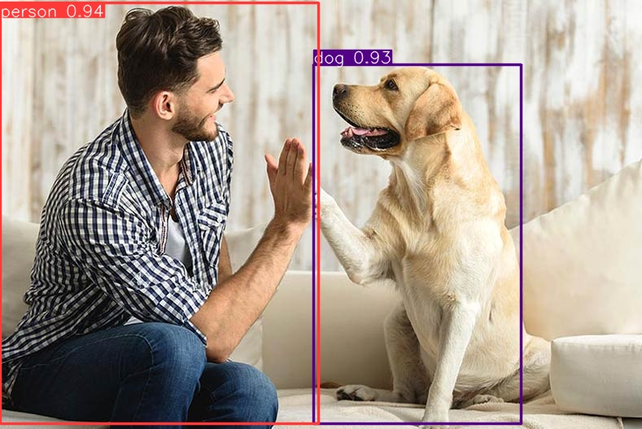

# Phát hiện vật thể trong ảnh vào video bằng YOLOv8
Giới thiệu

Dự án này được thực hiện sử dụng YOLOv8 để phát hiện các vật thể trong ảnh và video. YOLOv8 là một phiên bản tiên tiến của mô hình YOLO, nổi tiếng về khả năng nhận diện đối tượng thời gian thực. Trong dự án này, tôi đã sử dụng thư viện Ultralytics, triển khai bước đầu là phát hiện đối tượng trên ảnh và video, sau đó đào tạo mô hình với dữ liệu riêng được tạo và tải lên Roboflow. Quá trình này được thực hiện trên Google Colab.

### Cài đặt
Để chạy dự án này, bạn cần cài đặt các gói cần thiết.
1. Cài đặt thư viện `ultralytics` có mô hình YOLOv8 
```bash
pip install ultralytics
```
2. Cài đặt `roboflow` để đào tạo với dữ liệu riêng
```bash
pip install roboflow
```
### Sử dụng
Sau khi cài đặt, bạn có thể bắt đầu phát hiện đối tượng trong ảnh và video với các vật thể và video bằng các dữ liệu có sẵn trong YOLO với file `.pt`. `.pt` là file lưu trữ trọng số (weights) của mô hình đã được huấn luyện. Định dạng `.pt` thuộc về thư viện PyTorch, trong đó YOLOv8 cũng sử dụng PyTorch để xây dựng và huấn luyện mô hình.

- Có 4 `weights` sẵn trong mô hình YOLOv8 đã được đào tạo sẵn với các độ chính xác khác nhau. Trong dự án này tôi sử dụng `yolov8n.pt` với độ chính xác `nano`

**Tôi thực hiện detect với ảnh:**
```bash
!yolo task=detect mode=predict model=yolov8n.pt conf=0.25 source="https://www.akc.org/wp-content/uploads/2017/12/Yellow-Lab-High-Five.jpg"
```
Kết quả nhận được sau khi tôi detect vật thể từ ảnh trên



**Detect với video:**
```bash
!yolo task=detect mode=predict model=yolov8n.pt conf=0.25 source=/content/drive/MyDrive/source_1.mp4
```
### Đào tạo với dữ liệu riêng để thực hiện detect các vật thể chưa có sẵn trong các `weights` của mô hình:
**Trước tiên bạn cần có 1 tài khoản trên `https://roboflow.com/` và bạn phải có 1 dataset đã label trước, bạn có thể tìm hiểu thêm từ `https://docs.roboflow.com/` (trong bài này của tôi, tôi cũng đã đính kèm 1 file dataset về nón bảo hiểm đã được label, bạn có thể sử dụng để thực hành với nó `Hard Hat Sample.v2-augmented-416x416.yolov8.zip`)**
```bash
!pip install roboflow

from roboflow import Roboflow
rf = Roboflow(api_key="YOUR_API_KEY") #với YOUR_API_KEY là key api của bạn mà roboflow cấp
project = rf.workspace("industrial-university-of-ho-chi-minh-city-inppl").project("helmet-ttnt-luat-dep-trai")
dataset = project.version(2).download("yolov8")
```

Sau khi đào tạo với dữ liệu riêng xong, bạn có thể thực hiện detect với weights bạn đã đào tạo mô hình có tên file `best.pt`. Và các câu lệnh để bạn detect vật thể bằng dữ liệu riêng của bạn tương tự với dữ liệu đã được đào tạo sẵn trong mô hình của YOLO nhưng chỉ khác là bạn sử dụng file weights là `best.pt`

--------------
### Tham khảo:
1. https://docs.ultralytics.com/
2. https://docs.roboflow.com/